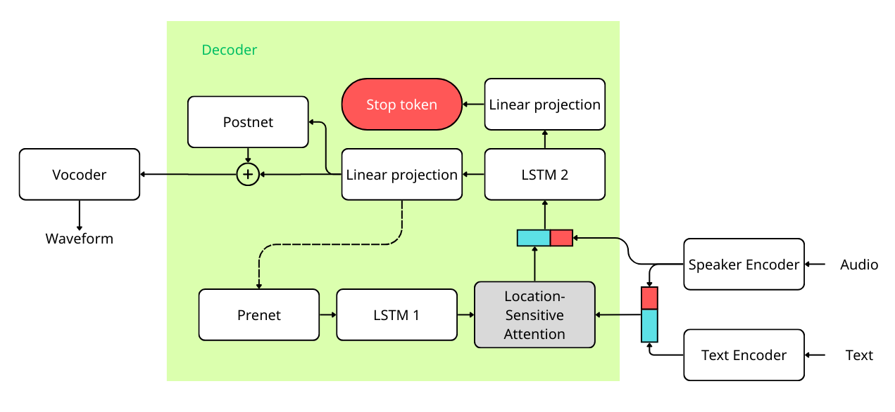
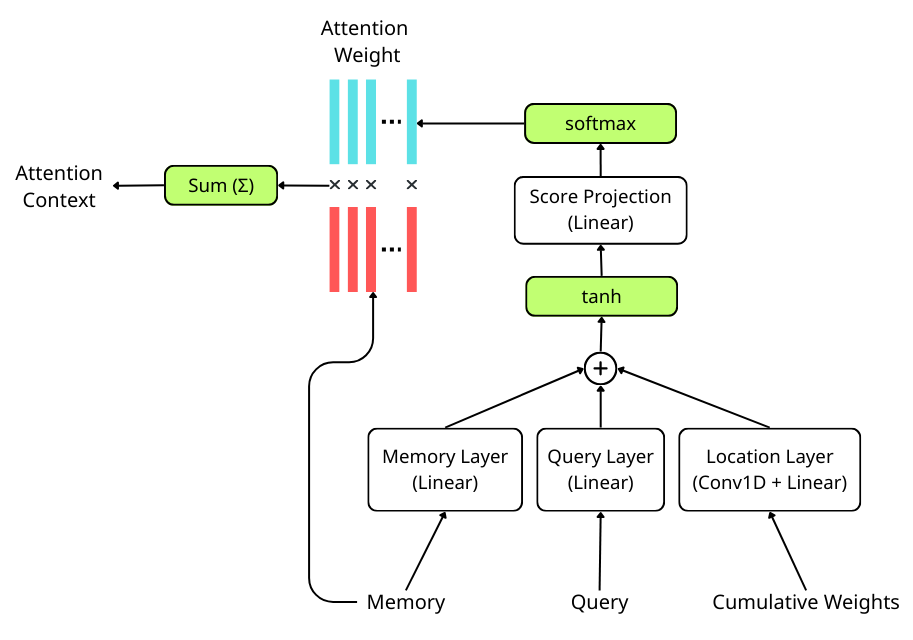
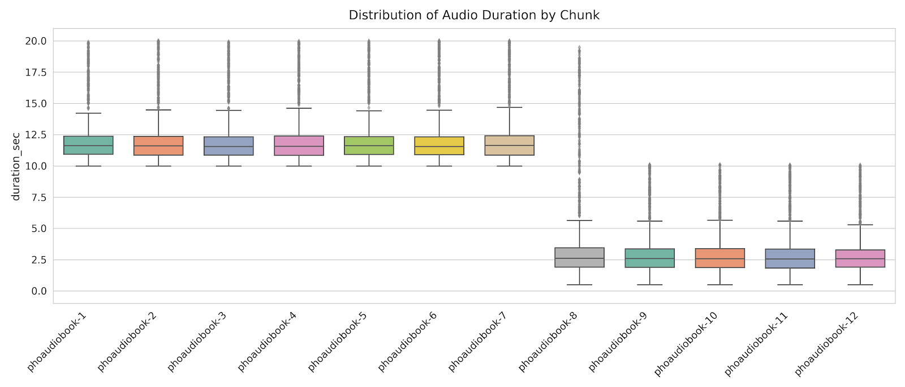
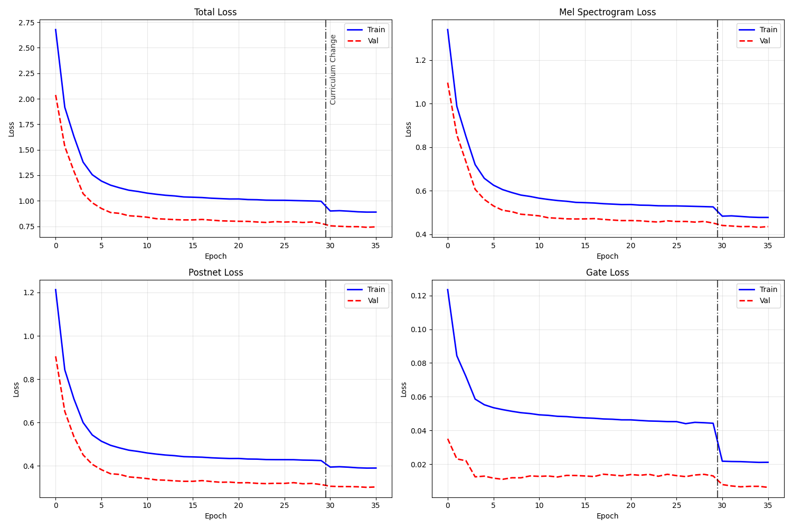
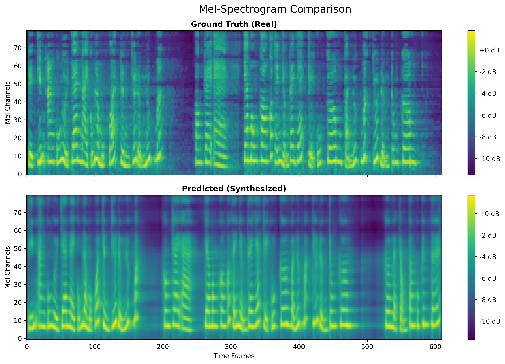

# **Vietnamese Voice Cloning TTS (Tacotron 2 + HiFi-GAN + ECAPA-TDNN)**
[](https://www.python.org/)
[](https://pytorch.org/)
[](https://opensource.org/licenses/MIT)

Dự án này cung cấp mã nguồn xây dựng hệ thống Tổng hợp tiếng nói (Text-to-Speech) đa người nói (Multi-speaker TTS) dành riêng cho tiếng Việt. Hệ thống hỗ trợ tính năng **Sao chép giọng nói (Voice Cloning)** linh hoạt với hai chiến lược: *Zero-shot* và *Few-shot Learning*.

## Tính năng
- **Tối ưu hóa ngữ âm Tiếng Việt:** Xử lý tốt từ điển gồm 102 ký tự, bao gồm các nguyên âm có dấu đặc trưng và các dấu câu ngắt nghỉ để tạo nhịp điệu tự nhiên.
- **Sao chép giọng nói (Zero-shot Voice Cloning):** Chỉ cần 1 đoạn âm thanh tham chiếu (vài giây) để hệ thống nhận diện và sinh ra âm thanh văn bản với màu giọng tương tự.
- **Chất lượng âm thanh trung thực:** Tái tạo sóng âm bằng HiFi-GAN đạt điểm MOS ổn (~3.3) với tốc độ sinh cao.
## Kiến trúc hệ thống
Hệ thống được thiết kế theo dạng End-to-End, chuyển đổi trực tiếp từ văn bản sang tín hiệu sóng âm bằng cách kết hợp 3 module cốt lõi.
<div align="center">
  
  
  <p><i>Sơ đồ kiến trúc tổng thể của hệ thống (Tacotron 2 + ECAPA-TDNN)</i></p>

</div>

### 1. Acoustic Model (Cải tiến từ Tacotron 2)
Mô hình âm học chịu trách nhiệm ánh xạ văn bản thành Phổ đồ Mel (Mel-spectrogram):
- **Text Encoder:** Mạng gồm 3 lớp Conv1D và 1 lớp Bi-LSTM để nắm bắt ngữ nghĩa và cấu trúc phát âm của câu.
- **Tích hợp Đặc trưng Người nói (Decoder Injection):** Vector đặc trưng người nói được nối vào vector đặc trưng văn bản từ Text Encoder. Trong quá trình hồi quy còn được nối vào kết quả trước khi vào lớp Decoder RNN.
### 2. Location-Sensitive Attention
Đây là "trái tim" của hệ thống, giúp mô hình học cách căn chỉnh (alignment) đơn điệu giữa văn bản đầu vào và khung phổ đầu ra.
<div align="center">

  
  <p><i>Sơ đồ chi tiết cơ chế Location-Sensitive Attention</i></p>

</div>
Bằng cách tích hợp thêm đặc trưng vị trí (f<sub>i</sub>) (từ ma trận trọng số lũy kế quá khứ), cơ chế này buộc hệ thống tiến lên phía trước, loại bỏ hoàn toàn hiện tượng lặp từ hay bỏ sót từ đặc trưng của mạng tuần tự.

### 3. Speaker Encoder & Vocoder
* **Speaker Encoder (ECAPA-TDNN):** Trích xuất *x-vector* 192 chiều từ âm thanh mẫu. Sử dụng Pre-trained model từ `SpeechBrain` huấn luyện trên VoxCeleb `speechbrain/spkrec-ecapa-voxceleb`.
* **Vocoder (HiFi-GAN):** Mạng đối kháng sinh chuyển đổi Mel-spectrogram thành tín hiệu sóng âm 16kHz sắc nét. Mô hình cũng có thể được lấy từ `SpeechBrain` với tên pretrained là `speechbrain/tts-hifigan-libritts-16kHz`.
---
## Dữ liệu huấn luyện
Mô hình được huấn luyện trên bộ dữ liệu cộng đồng `thivux/phoaudiobook` (Hugging Face).

* **Quy mô:** ~1500 giờ âm thanh, 710 giọng đọc đa dạng về tuổi tác, giới tính, vùng miền.
* **Tiền xử lý:**
  * Lọc độ dài âm thanh: 0.5s - 20s.
  * Lọc tốc độ nói: 8 - 22 ký tự/giây (cps).
  * Dữ liệu lưu dưới định dạng Apache Parquet chia thành 12 chunks để tối ưu I/O memory.
**
<div align="center">

  

</div>

## Cài đặt & Môi trường
Hệ thống được thiết kế để chạy trên GPU (NVIDIA T4 / H100).

**Yêu cầu môi trường:**
```text
python >= 3.11.13
torch == 2.6.0+cu124
torchaudio == 2.6.0+cu124
speechbrain == 1.0.3
datasets == 3.6.0
librosa == 0.11.0
```
**Cài đặt qua pip:**
```bash
git clone https://github.com/huutrank4ds/vi-tacotron2.git
cd vi-tacotron2
pip install -r requirements.txt
```
## Hướng dẫn sử dụng
Để tiến hành huấn luyện, bạn cần chọn **Add Input** tất cả các tập dữ liệu dưới đây vào Kaggle Notebook của mình:
### 1. Chuẩn bị dữ liệu
- Để huấn luyện được mô hình cần thêm vào notebook trên kaggle 12 dataset chunk dữ liệu. 
[phoaudiobook-1](https://www.kaggle.com/datasets/trungsunsilk/phoaudiobook-1)
[phoaudiobook-2](https://www.kaggle.com/datasets/trungsunsilk/phoaudiobook-2)
[phoaudiobook-3](https://www.kaggle.com/datasets/trungsunsilk/phoaudiobook-3)
[phoaudiobook-4](https://www.kaggle.com/datasets/trungsunsilk/phoaudiobook-4)
[phoaudiobook-5](https://www.kaggle.com/datasets/trungsunsilk/phoaudiobook-5)
[phoaudiobook-6](https://www.kaggle.com/datasets/trungsunsilk/phoaudiobook-6)
[phoaudiobook-7](https://www.kaggle.com/datasets/trungsunsilk/phoaudiobook-7)
[phoaudiobook-8](https://www.kaggle.com/datasets/trungsunsilk/phoaudiobook-8)
[phoaudiobook-9](https://www.kaggle.com/datasets/trungsunsilk/phoaudiobook-9)
[phoaudiobook-10](https://www.kaggle.com/datasets/trungsunsilk/phoaudiobook-10)
[phoaudiobook-11](https://www.kaggle.com/datasets/trungsunsilk/phoaudiobook-11)
[phoaudiobook-12](https://www.kaggle.com/datasets/trungsunsilk/phoaudiobook-12)
- Dữ liệu xác thực (validation) [validation dataset](https://www.kaggle.com/datasets/huutrank4ds/phoaudiobook-validation)
- Dữ liệu metadata [metadata](https://www.kaggle.com/datasets/huuvahan/phoaudiobook-parquet-metadata)
- Dữ liệu chứa embedding các speaker [speaker embedding](https://www.kaggle.com/datasets/huutrank4ds/mean-speaker-embeddings-phoaudiobook)
### 2. Huấn luyện (Training)
Quá trình huấn luyện ứng dụng 2 chiến lược tối ưu quan trọng:
- **Curriculum Learning:** Khởi động học với các câu ngắn, sau đó mở rộng ra toàn bộ dữ liệu.
- **Guided Attention Loss:** Ép buộc ma trận căn chỉnh học theo đường chéo trong các epoch đầu để giữ ổn định quá trình hội tụ trên tập dữ liệu lớn.

Quá trình huấn luyện được thực hiện trên môi trường kaggle đã xác thực, bằng cách import file train_tts.ipynb vào notebook của kaggle, chọn accelerator là GPU T4 x2 trở lên.
### 3. Suy luận (Voice Cloning Inference)
Dùng mô hình để tổng hợp một đoạn âm thanh với giọng người mới hoặc dựa trên tham chiếu các giọng nói có sẵn.
```bash
from config import Hparams
from synthesizer import Synthesizer

# Khởi tạo mô hình với trọng số đã huấn luyện
tacotron2_params =  Hparams()
synth = Synthesizer(tacotron2_params, tacotron2_checkpoint_path='checkpoints/checkpoint_vi_tacotron2_best.pt')

# Thông tin đầu vào
text = "Đây là một hệ thống sao chép giọng nói tiếng Việt."
# Nếu có âm thanh tham chiếu
# reference_audio = "path/to/speaker_sample.wav"
# Hoặc không có thể dùng tham chiếu từ file mean_speaker_embeddings.pt
mean_speaker_embeddings_agg = torch.load('/kaggle/input/mean-speaker-embeddings-phoaudiobook/mean_speaker_embeddings.pt')
speaker_embeddings_dict = {
    name: mean_speaker_embeddings_agg['mean_embeddings'][id]
    for id, name in mean_speaker_embeddings_agg['speaker_map'].items()
}
name_speaker = 'Quang_Thanh'
speaker_emb = speaker_embeddings_dict[name_speaker].unsqueeze(0).to(device)

# Sinh sóng âm thanh Zero-shot
# wav_output = synth.gen_wav(text, audio=reference_audio):
wav_output = synth.gen_wav(text, speaker_embedding=speaker_emb):

# Lưu file kết quả
synth.save_wav(wav_output, "output.wav")
```

## Kết quả đánh giá

### 1. Đánh giá định lượng (Quantitative Results)
Đánh giá trên tập Kiểm tra (Test Set) với 0.4 giờ âm thanh thuộc về nhóm **Unseen Speakers** (người nói chưa từng xuất hiện trong quá trình huấn luyện)[cite: 833, 834]:

| Metrics Đánh giá | Giá trị |
| :--- | :--- |
| **Độ tương đồng giọng nói (Cosine Similarity)** | `0.561 ± 0.101` |
| **Chất lượng cảm nhận thính giác (MOS)** | `3.129 ± 0.842` |

---

### 2. Phân tích quá trình huấn luyện (Training Logs)
Quá trình huấn luyện trải qua 50 epochs và được chia làm 3 giai đoạn chính dựa trên chiến lược **Curriculum Learning** và điều chỉnh trọng số **Guided Attention Loss**.

<div align="center">
  
  <p><i>Sự biến thiên hàm mất mát (Total, Mel, Postnet, Gate Loss) trong quá trình huấn luyện.</i></p>
</div>

---

### 3. Đánh giá định tính (Phổ Mel Spectrogram)
Việc đối chiếu Phổ Mel thực tế (Ground Truth) và Phổ Mel tổng hợp (Predicted) từ một mẫu kiểm tra cho thấy mô hình hoạt động hiệu quả:

<div align="center">
  
  <p><i>So sánh trực quan giữa phổ Mel thực tế (trên) và phổ Mel dự đoán (dưới).</i></p>
</div>

## Trích dẫn & Tham khảo

Nếu kho lưu trữ này hữu ích với nghiên cứu của bạn, vui lòng trích dẫn các báo cáo học thuật nền tảng:

* **Tacotron 2:** Shen et al., *"Natural TTS synthesis by conditioning WaveNet on mel spectrogram predictions"*.
* **HiFi-GAN:** Kong et al., *"HiFi-GAN: Generative adversarial networks for efficient and high fidelity speech synthesis"*.
* **ECAPA-TDNN:** Desplanques et al., *"ECAPA-TDNN: Emphasized channel attention, propagation and aggregation in TDNN based speaker verification"*.
* **Dataset:** Thivux, *"PhoAudiobook: A Vietnamese Speech Dataset"*.